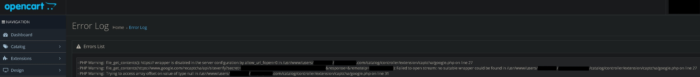
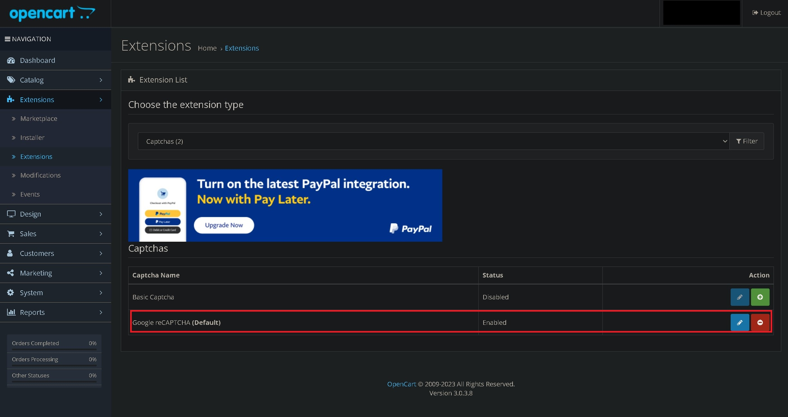

# Use cURL instead of file_get_contents() for OpenCart Google ReCaptcha

Once I had installed *OpenCart Version 3.0.3.8* I wanted to add a Google ReCaptcha to my forms..

I had setup my **sitekey** and **secretkey** and enabled the `Google reCAPTCHA (Default)` extension I tested my contact form and I received the `file_get_contents()` error.

[](img/1.jpg)

```
2023-12-08 11:30:44 - PHP Warning:  file_get_contents(): https:// wrapper is disabled in the server configuration by allow_url_fopen=0 in /usr/www/users/Username/myshop.com/catalog/controller/extension/captcha/google.php on line 27
2023-12-08 11:30:44 - PHP Warning:  file_get_contents(https://www.google.com/recaptcha/api/siteverify?secret=dfgkdsjbfiojsgfds&response=&remoteip=0.0.0.0): Failed to open stream: no suitable wrapper could be found in /usr/www/users/Username/myshop.com/catalog/controller/extension/captcha/google.php on line 27
2023-12-08 11:30:44 - PHP Warning:  Trying to access array offset on value of type null in /usr/www/users/Username/myshop.com/catalog/controller/extension/captcha/google.php on line 31
```

[](img/2.jpg)

Now I am not comfortable enabling `allow_url_fopen` in PHP on my server and you should also be wary since Unfortunately, `file_get_contents()` is a dangerous function when used with data obtained from user input, as it is the case. Using it could allow diverse kinds of attacks, from Denial of Service to loading of remote malicious resources.  You can also serve files that are not normally accessible, either due to server configuration, e.g. .htaccess, or file permissions.

So the simple solution is to not allow `allow_url_fopen` and to use curl!

I found a post on the OpenCart forum where an individual did exactly this.. the post is [here](https://forum.opencart.com/viewtopic.php?t=219173) this post is from *Jul 25, 2020* so I have included a code snippet below that works for me now in 2023.

### Go to your site myshopname.com/catalog/controller/extension/captcha/google.php

now change

```php
<?php
class ControllerExtensionCaptchaGoogle extends Controller {
    public function index($error = array()) {
        $this->load->language('extension/captcha/google');

        if (isset($error['captcha'])) {
			$data['error_captcha'] = $error['captcha'];
		} else {
			$data['error_captcha'] = '';
		}

		$data['site_key'] = $this->config->get('captcha_google_key');

        $data['route'] = $this->request->get['route']; 

		return $this->load->view('extension/captcha/google', $data);
    }

	    public function validate() {
		if (empty($this->session->data['gcapcha'])) {
			$this->load->language('extension/captcha/google');

			if (!isset($this->request->post['g-recaptcha-response'])) {
				return $this->language->get('error_captcha');
			}

			$recaptcha = file_get_contents('https://www.google.com/recaptcha/api/siteverify?secret=' . urlencode($this->config->get('captcha_google_secret')) . '&response=' . $this->request->post['g-recaptcha-response'] . '&remoteip=' . $this->request->server['REMOTE_ADDR']);

			$recaptcha = json_decode($recaptcha, true);

			if ($recaptcha['success']) {
				$this->session->data['gcapcha']	= true;
			} else {
				return $this->language->get('error_captcha');
			}
		}
    }
}


```

to

```php
<?php
class ControllerExtensionCaptchaGoogle extends Controller {
    public function index($error = array()) {
        $this->load->language('extension/captcha/google');

        if (isset($error['captcha'])) {
			$data['error_captcha'] = $error['captcha'];
		} else {
			$data['error_captcha'] = '';
		}

		$data['site_key'] = $this->config->get('captcha_google_key');

        $data['route'] = $this->request->get['route']; 

		return $this->load->view('extension/captcha/google', $data);
    }

	public function validate() {
		if (empty($this->session->data['gcapcha'])) {
			$this->load->language('extension/captcha/google');

			if (!isset($this->request->post['g-recaptcha-response'])) {
				return $this->language->get('error_captcha');
			}
			
			$data = array(
			    'secret' => $this->config->get('captcha_google_secret'),
			    'response' => $this->request->post['g-recaptcha-response'],
				'remoteip' => $this->request->server['REMOTE_ADDR']
			);
			
			$verify = curl_init();
			curl_setopt($verify, CURLOPT_URL, "https://www.google.com/recaptcha/api/siteverify");
			//curl_setopt($verify, CURLOPT_URL, "https://www.google.com/recaptcha/api/siteverify?secret=" . urlencode($this->config->get('captcha_google_secret')) . "&response=" . $this->request->post['g-recaptcha-response'] . "&remoteip=" . $this->request->server['REMOTE_ADDR']);
			curl_setopt($verify, CURLOPT_POST, true);
			curl_setopt($verify, CURLOPT_POSTFIELDS, http_build_query($data));
			curl_setopt($verify, CURLOPT_SSL_VERIFYPEER, false);
			curl_setopt($verify, CURLOPT_RETURNTRANSFER, true);
			$recaptcha = curl_exec($verify);
			
			//var_dump($recaptcha);
			
			$recaptcha = json_decode($recaptcha, true);

			if ($recaptcha['success']) {
				$this->session->data['gcapcha']	= true;
			} else {
				return $this->language->get('error_captcha');
			}
		}
    }
}

```

